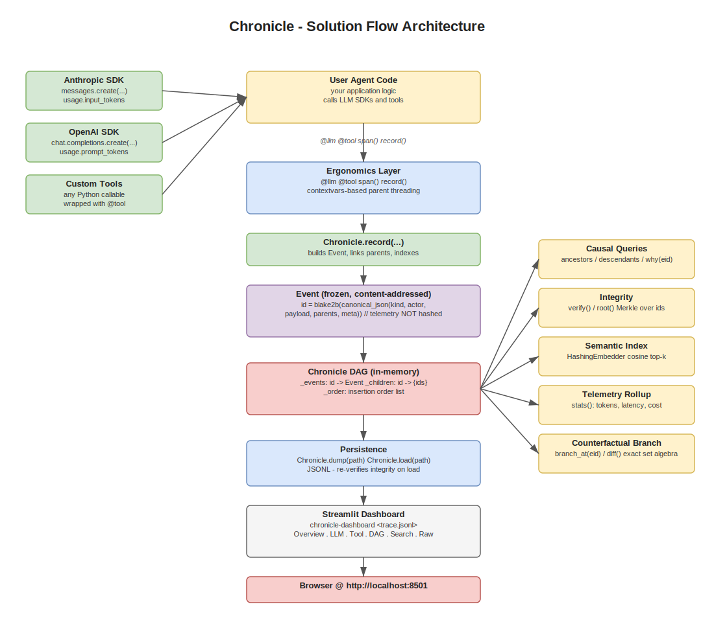

# chronicle

**Merkle-DAG agent traceability** — a content-addressed causal DAG of agent
events, with integrity verification, semantic search, telemetry rollups, and
a Streamlit dashboard.

Current observability tools (LangSmith, LangFuse, Phoenix, AgentOps,
OpenLLMetry) model agent traces as **hierarchical span trees** — a port of
OpenTelemetry's web-request model. Chronicle treats traces as
**content-addressed Merkle DAGs with a semantic overlay**, borrowing ideas
from git / IPFS. That single substrate unifies five concerns:

| Concern         | How it falls out of the design                                              |
|-----------------|-----------------------------------------------------------------------------|
| Causality       | Explicit parent pointers, not implicit nesting                              |
| Integrity       | Content-addressing → any mutation breaks downstream hashes (Merkle)         |
| Cross-run diff  | Identical sub-traces have identical ids across runs → set algebra works     |
| Semantic search | Embedding index keyed by event id                                           |
| Counterfactual  | Forking a DAG at a node is a first-class operation                          |

---

## Architecture



The diagram source is at [`docs/architecture.drawio`](docs/architecture.drawio).
Open it in [diagrams.net](https://app.diagrams.net) (or the VS Code "Draw.io
Integration" extension) to edit. To regenerate both the `.drawio` source and
the embedded `.svg` from a single Python layout spec:

```bash
.venv/bin/python _build_diagram.py
```

### How the flow works (left → right, top → bottom)

1. **Your agent code** calls LLM SDKs (Anthropic / OpenAI) and custom tool
   functions as part of normal application logic.
2. **The ergonomics layer** (`@llm`, `@tool`, `span()`) sits between your code
   and `Chronicle.record(...)`. It uses `contextvars` to thread the
   "current parent event" through nested calls automatically, so you never
   hand-pass event ids.
3. **`Chronicle.record(...)`** constructs an `Event`, validates that all
   `parents` already exist (acyclicity by construction), and indexes it.
4. **`Event`** is a frozen dataclass. Its `id` is the blake2b hash of a
   canonical-JSON encoding of `(kind, actor, payload, parents, meta)`.
   `telemetry` (durations, token counts, cost, wall-clock) is deliberately
   **excluded from the hash** — so recording it does not destroy the
   cross-run-identity property.
5. **The DAG** is held in memory: `_events` maps id → Event, `_children`
   gives forward edges, `_order` preserves insertion order.
6. **Five views** sit on top of the same DAG: causal queries
   (`ancestors`, `descendants`, `why`), integrity (`verify`, `root`),
   semantic (`HashingEmbedder` + cosine top-k), telemetry rollups
   (`stats()`), and counterfactual branching (`branch_at`, `diff`).
7. **Persistence** is JSONL — `dump()` writes, `load()` re-verifies integrity
   while reading.
8. **The Streamlit dashboard** is a single-file UI shipped in the wheel and
   exposed as the `chronicle-dashboard` console script. It loads any JSONL
   trace and renders metric cards, sortable LLM/tool tables, the full causal
   DAG, semantic search, and per-event drill-down.

---

## Quick start

```bash
# install the locally-built wheel
pip install dist/chronicle-0.2.0-py3-none-any.whl

# (optional) install dashboard extras
pip install "chronicle[dashboard] @ ./dist/chronicle-0.2.0-py3-none-any.whl"
```

```python
import chronicle
from chronicle import Chronicle, span, tool, llm

c = Chronicle()
prompt = c.record("prompt", actor="user", payload={"text": "..."})

@tool("search")
def search(q): ...

@llm(model="claude-opus-4-7")
def ask(messages):
    # any anthropic / openai client call; usage is auto-extracted
    return client.messages.create(model="claude-opus-4-7", messages=messages)

with span(c, actor="agent:planner", parent=prompt.id) as s:
    s.thought("plan")
    hits = search("query")
    ask(messages=[{"role": "user", "content": "..."}])
    s.answer("done")

# Inspect
print(c.root())          # Merkle root — identical across deterministic runs
print(c.verify())        # (True, []) if untampered
print(c.stats())         # tokens, latency, cost, per-model breakdown
c.dump("trace.jsonl")    # persist
```

---

## Core API

| Symbol                              | What it does                                              |
|-------------------------------------|-----------------------------------------------------------|
| `Chronicle()`                       | New empty trace                                           |
| `c.record(kind, actor, payload, parents, meta, telemetry)` | Append an event |
| `c.why(event_id)`                   | Topological list of causal ancestors                      |
| `c.ancestors(id) / c.descendants(id)` | Set of ids upstream / downstream                        |
| `c.verify()`                        | `(ok, bad_ids)` — Merkle integrity check                  |
| `c.root()`                          | Merkle root over the event set                            |
| `c.search(text, k=5)`               | Cosine top-k semantic search                              |
| `c.stats()`                         | Run-level telemetry rollup                                |
| `c.branch_at(event_id)`             | Fork the DAG at this event; ancestors are shared by id    |
| `Chronicle.diff(a, b)`              | Exact set diff over event ids                             |
| `c.dump(path) / Chronicle.load(path)` | JSONL round-trip with integrity check on load           |
| `@tool` / `@llm` / `span()`         | Ergonomic recording — auto-parent threading via contextvars |
| `record_llm(c, model=..., prompt=..., response=..., input_tokens=..., output_tokens=..., duration_ms=...)` | Manual LLM-call recording |
| `set_prices({"model": (in, out), ...})` | Override the per-million-token price table          |

---

## Dashboard

The dashboard is exposed as the `chronicle-dashboard` console script:

```bash
chronicle-dashboard demo_trace.jsonl
# serves at http://localhost:8501
```

or from Python:

```python
from chronicle.dashboard import launch
launch("demo_trace.jsonl")
```

Tabs:

- **Overview** — metric cards (events, LLM calls, tool calls, tokens, latency,
  estimated cost), event-kind histogram, per-model breakdown table
- **LLM calls** — sortable table of every `llm_result` with model, token
  counts, duration, cost, and a preview of the response text
- **Tool calls** — sortable table of every `tool_result` with duration and
  result preview, plus a latency bar chart
- **DAG** — the full causal graph rendered with matplotlib + networkx
- **Search** — semantic top-k search box with score and event payload preview
- **Raw** — per-event drill-down (payload, telemetry, meta, parents)

A live **integrity badge** at the top of every page shows the current Merkle
root and verification status.

Dashboard deps (`streamlit`, `pandas`, `matplotlib`, `networkx`) are declared
in the optional `[dashboard]` extra so the core wheel stays `numpy`-only.

---

## Verification checks

The notebook runs eight checks end-to-end as part of building the wheel.
All must pass or the wheel does not get built:

1. Recording chains correctly via the ergonomic API.
2. **Cross-run identity** — two independent runs produce the same Merkle root
   even though wall-clock durations differ (telemetry is not hashed).
3. **Tamper detection** — a manual mutation is caught by `verify()`.
4. **Causal query** — `why(answer_id)` returns exactly the expected reasoning
   path: `prompt → thought → tool_call → tool_result → thought → llm_call →
   llm_result → answer`.
5. **Semantic recall** — `search(...)` surfaces meaning-relevant events.
6. **Counterfactual diff** — a branched continuation diffs to exactly the
   divergent events (no overlap with the original).
7. **JSONL round-trip** — `dump()` then `load()` preserves the Merkle root.
8. **Telemetry rollup** — `stats()` reports llm calls, tool calls, tokens,
   durations, per-model breakdown, and estimated cost.

---

## Project layout

```
.
├── notebook/
│   └── chronicle.ipynb        # the source-of-truth; running it builds everything
├── src/chronicle/             # package source (written by the notebook)
│   ├── __init__.py            # public API, demo()
│   ├── event.py               # frozen Event, content-addressed hashing
│   ├── core.py                # Chronicle, record(), causal queries
│   ├── integrity.py           # verify(), Merkle root
│   ├── semantic.py            # HashingEmbedder, SemanticIndex
│   ├── ergonomics.py          # @tool, span(), contextvars parent threading
│   ├── branch.py              # branch_at, diff
│   ├── telemetry.py           # @llm, record_llm, stats(), cost estimation
│   └── dashboard.py           # Streamlit app + chronicle-dashboard CLI
├── docs/
│   ├── architecture.drawio    # editable diagram source (open in draw.io)
│   └── architecture.svg       # rendered embed for this README
├── dist/
│   └── chronicle-0.2.0-py3-none-any.whl
├── pyproject.toml             # PEP-621 metadata, [dashboard] extra
├── _build_notebook.py         # generator for chronicle.ipynb
└── _build_diagram.py          # generator for docs/{architecture.drawio,.svg}
```

`notebook/chronicle.ipynb` is the canonical artifact: running it top-to-bottom
materializes everything under `src/chronicle/`, writes `pyproject.toml`, runs
all eight verification checks, builds `dist/chronicle-0.2.0-py3-none-any.whl`,
installs it, and re-imports to confirm.

---

## Regenerating

```bash
# Rebuild the notebook from _build_notebook.py
.venv/bin/python _build_notebook.py

# Execute it end-to-end (rebuilds the wheel and installs it)
.venv/bin/python -m jupyter nbconvert \
    --to notebook --execute --inplace notebook/chronicle.ipynb \
    --ExecutePreprocessor.timeout=300

# Regenerate the architecture diagram (.drawio + .svg)
.venv/bin/python _build_diagram.py
```

---

## Limitations & next steps

- In-memory only; persistence is JSONL. Fine for research scale, not for
  long-running production agents.
- No cryptographic signatures yet — tamper detection is integrity-only.
  Add signed Merkle roots (Ed25519) for adversarial-robustness work.
- No OpenTelemetry bridge. Adding an exporter would let traces flow into
  Jaeger / Tempo / Langfuse for cross-comparison with span-tree tools.
- The default `HashingEmbedder` is cheap and dependency-free but lower-quality
  than transformer embeddings. Use `chronicle[st]` to opt into
  `sentence-transformers`.
